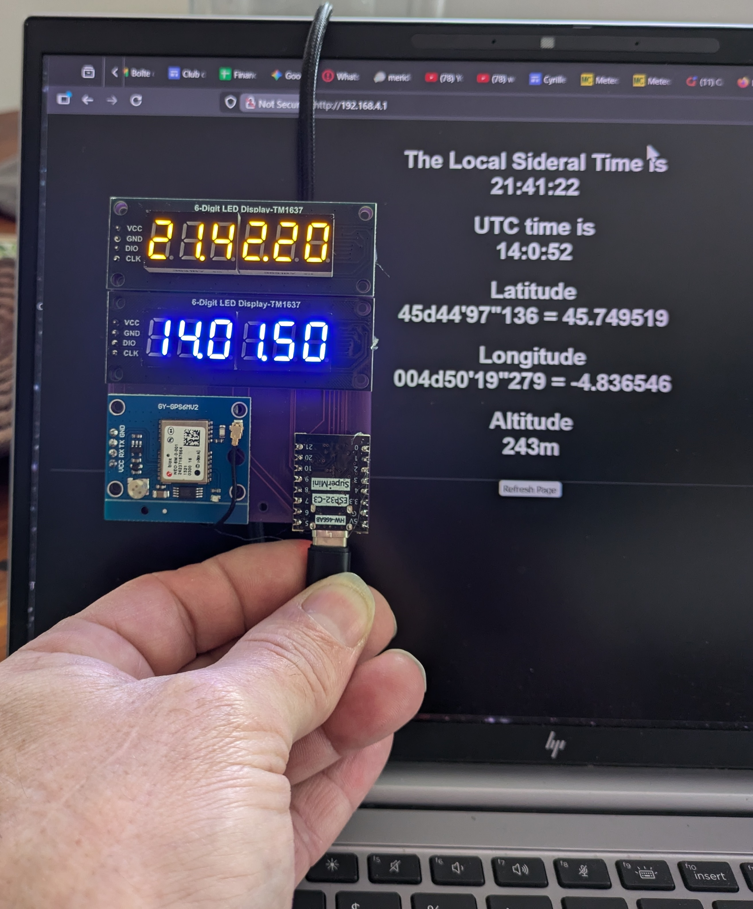
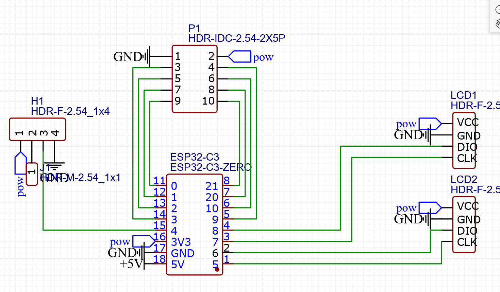

# LocalSideralTimeGPS
This is an esp32 project that indicates the local sideral time and provides GPS data.

Build around an esp32-C3 super mini, a GPS module and 2 segmented displays.

PCB available here: https://oshwlab.com/cyrille.de.brebisson/local-sideral-time

The source code is using the arduino system.

parts:
NEO-6M GPS module: https://fr.aliexpress.com/item/1005006495592091.html
LCD: 6 letter TM1637 display (2 of 2 different colors) https://fr.aliexpress.com/item/1005002060670160.html
ESP32-C3 super mini (easy to find on ali express).

Note that I have added a header in case of future uses. Not used for the moment.

